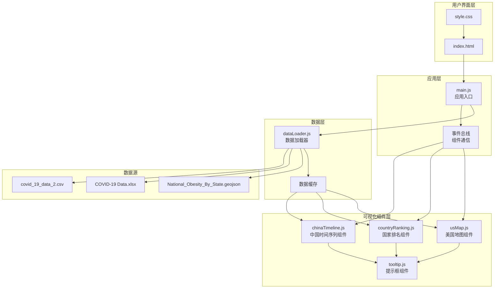

# COVID-19交互式可视化系统 - 技术设计文档

## Overview

本设计文档描述了COVID-19交互式可视化系统的技术架构和实现方案。该系统是一个纯静态网页应用，使用D3.js v7作为核心可视化库，部署在GitHub Pages上。

### 核心目标

- 提供三个独立的可视化组件：美国地图、国家排名柱状图、中国省份时间序列折线图
- 实现流畅的交互体验（响应时间<200ms，动画60fps）
- 支持多种数据指标切换和筛选功能
- 确保跨浏览器兼容性和响应式设计
- 零服务器依赖，完全静态部署

### 技术栈

- **可视化库**: D3.js v7（数据驱动的DOM操作和SVG渲染）
- **数据解析**: SheetJS (xlsx.js) 用于Excel文件解析
- **前端**: 原生JavaScript (ES6+)、HTML5、CSS3
- **部署**: GitHub Pages（静态托管）
- **浏览器支持**: Chrome、Firefox、Safari、Edge（最新版本）

### 设计原则

1. **模块化**: 每个图表组件独立封装，通过统一接口通信
2. **数据驱动**: 使用D3.js的数据绑定模式，声明式更新DOM
3. **性能优先**: 数据缓存、虚拟化渲染、防抖节流
4. **渐进增强**: 核心功能优先，交互增强次之
5. **错误容错**: 优雅降级，清晰的错误提示

## Architecture

### 系统架构图



### 架构层次说明

#### 1. 用户界面层
- **index.html**: 单页应用入口，包含三个图表容器和交互控件
- **style.css**: 全局样式、响应式布局、主题配色

#### 2. 应用层
- **main.js**: 应用生命周期管理、组件初始化、全局状态管理
- **事件总线**: 轻量级发布-订阅模式，实现组件间解耦通信

#### 3. 数据层
- **dataLoader.js**: 统一的数据加载、解析、验证接口
- **数据缓存**: 内存缓存已解析数据，避免重复计算

#### 4. 可视化组件层
- 每个组件独立封装，暴露统一的API（init、update、destroy）
- 组件间通过事件总线通信，不直接依赖

### 目录结构

```
/
├── index.html                    # 主页面
├── css/
│   └── style.css                # 全局样式
├── js/
│   ├── main.js                  # 应用入口（约200行）
│   ├── dataLoader.js            # 数据加载模块（约300行）
│   ├── eventBus.js              # 事件总线（约50行）
│   ├── usMap.js                 # 美国地图组件（约400行）
│   ├── countryRanking.js        # 国家排名组件（约300行）
│   ├── chinaTimeline.js         # 中国时间序列组件（约400行）
│   └── tooltip.js               # 提示框组件（约100行）
├── visualization_dataset/        # 数据文件
│   ├── National_Obesity_By_State.geojson
│   ├── COVID-19 Data.xlsx
│   └── covid_19_data_2.csv
└── lib/                         # 第三方库（CDN备份）
    ├── d3.v7.min.js
    └── xlsx.full.min.js
```

## Components and Interfaces

### 1. DataLoader 模块

**职责**: 加载、解析、验证所有数据源

**接口**:

```javascript
class DataLoader {
  /**
   * 加载所有数据文件
   * @returns {Promise<Object>} 包含所有解析后数据的对象
   * @throws {Error} 数据加载或解析失败时抛出错误
   */
  async loadAll()
  
  /**
   * 加载GeoJSON地图数据
   * @returns {Promise<Object>} GeoJSON特征集合
   */
  async loadGeoJSON()
  
  /**
   * 加载美国COVID数据（Excel）
   * @returns {Promise<Array>} 美国各州数据数组
   */
  async loadUSCovidData()
  
  /**
   * 加载全球COVID时间序列数据（CSV）
   * @returns {Promise<Array>} 全球时间序列数据数组
   */
  async loadGlobalCovidData()
  
  /**
   * 验证数据完整性
   * @param {Array} data - 待验证数据
   * @param {Array<string>} requiredFields - 必需字段列表
   * @returns {boolean} 验证是否通过
   */
  validateData(data, requiredFields)
}
```

**数据格式约定**:

```javascript
// 美国COVID数据格式
{
  state: string,           // 州名称
  confirmed: number,       // 确诊数
  deaths: number,          // 死亡数
  recovered: number        // 治愈数
}

// 全球COVID数据格式
{
  date: Date,              // 日期
  country: string,         // 国家/地区
  province: string,        // 省份/州（可选）
  confirmed: number,       // 累计确诊
  deaths: number,          // 累计死亡
  recovered: number        // 累计治愈
}
```

### 2. EventBus 模块

**职责**: 组件间解耦通信

**接口**:

```javascript
class EventBus {
  /**
   * 订阅事件
   * @param {string} event - 事件名称
   * @param {Function} callback - 回调函数
   */
  on(event, callback)
  
  /**
   * 发布事件
   * @param {string} event - 事件名称
   * @param {*} data - 事件数据
   */
  emit(event, data)
  
  /**
   * 取消订阅
   * @param {string} event - 事件名称
   * @param {Function} callback - 回调函数
   */
  off(event, callback)
}
```

**事件定义**:

```javascript
// 数据加载完成
'data:loaded' -> { usData, globalData, geoData }

// 指标切换（国家排名图表）
'metric:changed' -> { metric: 'confirmed' | 'deaths' | 'recovered' }

// 省份筛选（中国时间序列图表）
'provinces:filtered' -> { provinces: string[] }

// 错误事件
'error:occurred' -> { message: string, details: Error }
```

### 3. USMap 组件

**职责**: 渲染美国地图，显示各州COVID数据

**接口**:

```javascript
class USMap {
  /**
   * 初始化地图组件
   * @param {string} containerId - 容器DOM ID
   * @param {Object} geoData - GeoJSON数据
   * @param {Array} covidData - 美国COVID数据
   */
  constructor(containerId, geoData, covidData)
  
  /**
   * 渲染地图
   */
  render()
  
  /**
   * 更新数据
   * @param {Array} newData - 新的COVID数据
   */
  update(newData)
  
  /**
   * 销毁组件
   */
  destroy()
}
```

**内部方法**:

```javascript
// 创建投影和路径生成器
_createProjection()

// 创建颜色比例尺
_createColorScale(data)

// 绑定鼠标事件
_bindEvents()

// 显示/隐藏提示框
_showTooltip(stateData, event)
_hideTooltip()
```

### 4. CountryRanking 组件

**职责**: 渲染国家排名柱状图，支持指标切换

**接口**:

```javascript
class CountryRanking {
  /**
   * 初始化柱状图组件
   * @param {string} containerId - 容器DOM ID
   * @param {Array} globalData - 全球COVID数据
   */
  constructor(containerId, globalData)
  
  /**
   * 渲染柱状图
   * @param {string} metric - 指标类型 ('confirmed' | 'deaths' | 'recovered')
   */
  render(metric = 'confirmed')
  
  /**
   * 更新指标
   * @param {string} metric - 新指标类型
   */
  updateMetric(metric)
  
  /**
   * 销毁组件
   */
  destroy()
}
```

**内部方法**:

```javascript
// 聚合国家数据（处理多省份）
_aggregateCountryData(data, metric)

// 获取Top 6国家
_getTopCountries(data, metric, count = 6)

// 创建坐标轴
_createAxes(data)

// 动画过渡
_transitionBars(newData)
```

### 5. ChinaTimeline 组件

**职责**: 渲染中国省份时间序列折线图，支持省份筛选

**接口**:

```javascript
class ChinaTimeline {
  /**
   * 初始化折线图组件
   * @param {string} containerId - 容器DOM ID
   * @param {Array} globalData - 全球COVID数据
   */
  constructor(containerId, globalData)
  
  /**
   * 渲染折线图
   * @param {Array<string>} provinces - 要显示的省份列表（空数组表示全部）
   */
  render(provinces = [])
  
  /**
   * 更新省份筛选
   * @param {Array<string>} provinces - 新的省份列表
   */
  updateProvinces(provinces)
  
  /**
   * 销毁组件
   */
  destroy()
}
```

**内部方法**:

```javascript
// 过滤中国大陆数据
_filterChinaData(data)

// 按省份分组时间序列
_groupByProvince(data)

// 创建时间比例尺和数值比例尺
_createScales(data)

// 创建折线生成器
_createLineGenerator()

// 创建图例
_createLegend(provinces)

// 动画过渡
_transitionLines(newData)
```

### 6. Tooltip 组件

**职责**: 显示鼠标悬停时的详细信息

**接口**:

```javascript
class Tooltip {
  /**
   * 初始化提示框
   */
  constructor()
  
  /**
   * 显示提示框
   * @param {Object} data - 要显示的数据
   * @param {MouseEvent} event - 鼠标事件（用于定位）
   */
  show(data, event)
  
  /**
   * 隐藏提示框
   */
  hide()
  
  /**
   * 格式化数据为HTML
   * @param {Object} data - 数据对象
   * @returns {string} HTML字符串
   */
  format(data)
}
```

### 7. Main 应用入口

**职责**: 应用生命周期管理、组件协调

**主要流程**:

```javascript
async function init() {
  try {
    // 1. 显示加载指示器
    showLoadingIndicator()
    
    // 2. 初始化事件总线
    const eventBus = new EventBus()
    
    // 3. 加载所有数据
    const dataLoader = new DataLoader()
    const { usData, globalData, geoData } = await dataLoader.loadAll()
    
    // 4. 初始化组件
    const usMap = new USMap('us-map-container', geoData, usData)
    const countryRanking = new CountryRanking('country-ranking-container', globalData)
    const chinaTimeline = new ChinaTimeline('china-timeline-container', globalData)
    
    // 5. 绑定事件监听
    setupEventListeners(eventBus, { usMap, countryRanking, chinaTimeline })
    
    // 6. 渲染所有组件
    usMap.render()
    countryRanking.render('confirmed')
    chinaTimeline.render([])
    
    // 7. 隐藏加载指示器
    hideLoadingIndicator()
    
    // 8. 发布数据加载完成事件
    eventBus.emit('data:loaded', { usData, globalData, geoData })
    
  } catch (error) {
    handleError(error)
  }
}

function setupEventListeners(eventBus, components) {
  // 指标切换
  document.getElementById('metric-selector').addEventListener('change', (e) => {
    eventBus.emit('metric:changed', { metric: e.target.value })
  })
  
  // 省份筛选
  document.getElementById('province-filter').addEventListener('change', (e) => {
    const selected = Array.from(e.target.selectedOptions).map(opt => opt.value)
    eventBus.emit('provinces:filtered', { provinces: selected })
  })
  
  // 订阅事件
  eventBus.on('metric:changed', ({ metric }) => {
    components.countryRanking.updateMetric(metric)
  })
  
  eventBus.on('provinces:filtered', ({ provinces }) => {
    components.chinaTimeline.updateProvinces(provinces)
  })
}
```

## Data Models

### 1. GeoJSON数据模型

```javascript
{
  type: "FeatureCollection",
  features: [
    {
      type: "Feature",
      properties: {
        NAME: string,        // 州名称
        // 其他属性...
      },
      geometry: {
        type: "Polygon" | "MultiPolygon",
        coordinates: Array   // 坐标数组
      }
    }
  ]
}
```

### 2. 美国COVID数据模型

**原始Excel格式** (COVID-19 Data.xlsx):
- 假设包含列: State, Confirmed, Deaths, Recovered

**解析后格式**:

```javascript
[
  {
    state: "California",
    confirmed: 1234567,
    deaths: 12345,
    recovered: 1000000
  },
  // ...
]
```

### 3. 全球COVID数据模型

**原始CSV格式** (covid_19_data_2.csv):
- 假设包含列: ObservationDate, Province/State, Country/Region, Confirmed, Deaths, Recovered

**解析后格式**:

```javascript
[
  {
    date: Date("2020-01-22"),
    province: "Hubei",
    country: "Mainland China",
    confirmed: 444,
    deaths: 17,
    recovered: 28
  },
  // ...
]
```

### 4. 聚合数据模型

**国家聚合数据** (用于国家排名):

```javascript
{
  country: string,
  confirmed: number,
  deaths: number,
  recovered: number,
  lastUpdate: Date
}
```

**省份时间序列数据** (用于中国折线图):

```javascript
{
  province: string,
  timeSeries: [
    { date: Date, confirmed: number },
    // ...
  ]
}
```

### 5. 数据转换流程


**关键转换函数**:

```javascript
// 1. 日期解析
function parseDate(dateString) {
  // 支持多种日期格式: "MM/DD/YYYY", "YYYY-MM-DD"
  return new Date(dateString)
}

// 2. 数值清洗
function parseNumber(value) {
  // 处理空值、字符串数字、千分位分隔符
  if (!value || value === '') return 0
  return parseInt(String(value).replace(/,/g, ''), 10) || 0
}

// 3. 国家名称标准化
function normalizeCountryName(name) {
  // 统一国家名称（如 "Mainland China" -> "China"）
  const mapping = {
    'Mainland China': 'China',
    'US': 'United States',
    // ...
  }
  return mapping[name] || name
}

// 4. 数据聚合
function aggregateByCountry(data, metric) {
  const grouped = d3.group(data, d => d.country)
  return Array.from(grouped, ([country, records]) => ({
    country,
    [metric]: d3.sum(records, d => d[metric]),
    lastUpdate: d3.max(records, d => d.date)
  }))
}
```

### 6. 数据缓存策略

```javascript
class DataCache {
  constructor() {
    this.cache = new Map()
  }
  
  set(key, value) {
    this.cache.set(key, {
      data: value,
      timestamp: Date.now()
    })
  }
  
  get(key) {
    const cached = this.cache.get(key)
    if (!cached) return null
    
    // 缓存有效期: 1小时（对于静态数据可以永久缓存）
    const isValid = (Date.now() - cached.timestamp) < 3600000
    return isValid ? cached.data : null
  }
  
  clear() {
    this.cache.clear()
  }
}
```

## Correctness Properties

*属性（Property）是指在系统所有有效执行中都应保持为真的特征或行为——本质上是关于系统应该做什么的形式化陈述。属性是人类可读规范与机器可验证正确性保证之间的桥梁。*

本项目的正确性属性主要集中在**数据处理层**，包括数据解析、转换、聚合和验证逻辑。UI渲染和交互部分将通过集成测试和示例测试覆盖。

### Property 1: 数据解析保持结构完整性

*对于任何*有效的JSON或CSV格式数据，解析后的数据结构应包含所有必需字段，且字段类型正确（日期解析为Date对象，数值解析为number类型）。

**Validates: Requirements 1.1, 1.2, 1.3**

### Property 2: 数据验证正确识别缺失字段

*对于任何*数据对象和必需字段列表，如果数据对象缺少任何必需字段，validateData函数应返回false；如果包含所有必需字段，应返回true。

**Validates: Requirements 1.5, 8.2**

### Property 3: 颜色比例尺映射单调性

*对于任何*数值范围和颜色比例尺，较大的输入值应映射到颜色序列中较深（或较浅，取决于配置）的颜色，保持单调性。

**Validates: Requirements 2.2**

### Property 4: Tooltip格式化包含所有必需信息

*对于任何*包含州名称、confirmed、deaths、recovered字段的数据对象，tooltip格式化函数返回的HTML字符串应包含所有这些字段的值。

**Validates: Requirements 2.4**

### Property 5: 国家数据聚合正确性

*对于任何*包含多个省份记录的国家数据，按国家聚合后的指标值（confirmed/deaths/recovered）应等于该国家所有省份对应指标值的总和。

**Validates: Requirements 3.1, 3.3, 7.2**

### Property 6: Top N排序正确性

*对于任何*数据集和指标，getTopCountries函数返回的前N个国家应按该指标降序排列，且返回的国家数量应等于min(N, 数据集中国家总数)。

**Validates: Requirements 3.1, 3.2**

### Property 7: 中国数据过滤完整性

*对于任何*全球COVID数据集，过滤"Mainland China"后的结果应只包含country字段为"Mainland China"的记录，且不应遗漏任何此类记录。

**Validates: Requirements 4.1, 4.2**

### Property 8: 省份筛选正确性

*对于任何*省份列表和中国数据集，按省份筛选后的结果应只包含province字段在筛选列表中的记录；如果筛选列表为空，应返回所有记录。

**Validates: Requirements 4.3**

### Property 9: 颜色分配唯一性

*对于任何*省份列表（长度≤颜色池大小），颜色分配函数应为每个不同的省份分配不同的颜色。

**Validates: Requirements 4.6**

### Property 10: 数值解析精度保持

*对于任何*有效的数值字符串（包括带千分位分隔符的），parseNumber函数解析后的数值应等于原始数值，不应引入精度损失（在整数范围内）。

**Validates: Requirements 7.1**

### Property 11: 缓存一致性

*对于任何*键值对，在缓存有效期内，通过相同键get获取的值应与之前set的值相同（深度相等）。

**Validates: Requirements 7.4**

### Property 12: 空数据集处理

*对于任何*导致空结果集的筛选条件，系统应返回空数组（而非null或undefined），且不应抛出错误。

**Validates: Requirements 8.5**

## Error Handling

### 错误分类

系统错误分为以下几类：

1. **数据加载错误** (Data Loading Errors)
   - 文件不存在 (404)
   - 网络错误 (Network failure)
   - 权限错误 (403)

2. **数据解析错误** (Data Parsing Errors)
   - JSON格式错误
   - CSV格式错误
   - Excel文件损坏
   - 字段类型不匹配

3. **数据验证错误** (Data Validation Errors)
   - 缺少必需字段
   - 数值超出合理范围
   - 日期格式无效

4. **运行时错误** (Runtime Errors)
   - 浏览器不支持必需功能 (SVG, ES6)
   - 内存不足
   - DOM操作失败

### 错误处理策略

#### 1. 数据加载错误处理

```javascript
async function loadDataWithRetry(url, maxRetries = 3) {
  for (let i = 0; i < maxRetries; i++) {
    try {
      const response = await fetch(url)
      if (!response.ok) {
        throw new Error(`HTTP ${response.status}: ${response.statusText}`)
      }
      return await response.text()
    } catch (error) {
      if (i === maxRetries - 1) {
        // 最后一次重试失败，显示用户友好的错误消息
        showError({
          title: '数据加载失败',
          message: `无法加载文件 ${url}`,
          details: error.message,
          action: '请检查网络连接或稍后重试'
        })
        throw error
      }
      // 指数退避重试
      await sleep(Math.pow(2, i) * 1000)
    }
  }
}
```

#### 2. 数据解析错误处理

```javascript
function parseDataSafely(rawData, parser, dataType) {
  try {
    const parsed = parser(rawData)
    
    // 验证解析结果
    if (!parsed || !Array.isArray(parsed) || parsed.length === 0) {
      throw new Error(`解析后的${dataType}数据为空`)
    }
    
    return parsed
  } catch (error) {
    showError({
      title: '数据解析失败',
      message: `${dataType}数据格式不正确`,
      details: error.message,
      action: '请确保数据文件格式正确'
    })
    
    // 返回空数组，允许应用继续运行（降级模式）
    return []
  }
}
```

#### 3. 数据验证错误处理

```javascript
function validateDataWithFeedback(data, requiredFields, dataType) {
  const missingFields = []
  
  for (const record of data.slice(0, 10)) { // 只检查前10条
    for (const field of requiredFields) {
      if (!(field in record)) {
        missingFields.push(field)
      }
    }
  }
  
  if (missingFields.length > 0) {
    showWarning({
      title: '数据验证警告',
      message: `${dataType}数据缺少必需字段`,
      details: `缺少字段: ${[...new Set(missingFields)].join(', ')}`,
      action: '部分功能可能无法正常工作'
    })
    return false
  }
  
  return true
}
```

#### 4. 浏览器兼容性检查

```javascript
function checkBrowserCompatibility() {
  const features = {
    svg: !!document.createElementNS && 
         !!document.createElementNS('http://www.w3.org/2000/svg', 'svg').createSVGRect,
    fetch: typeof fetch !== 'undefined',
    promise: typeof Promise !== 'undefined',
    es6: (function() {
      try {
        eval('const x = () => {}')
        return true
      } catch (e) {
        return false
      }
    })()
  }
  
  const unsupported = Object.entries(features)
    .filter(([_, supported]) => !supported)
    .map(([feature]) => feature)
  
  if (unsupported.length > 0) {
    showError({
      title: '浏览器不兼容',
      message: '您的浏览器不支持必需的功能',
      details: `不支持的功能: ${unsupported.join(', ')}`,
      action: '请使用Chrome、Firefox、Safari或Edge的最新版本'
    })
    return false
  }
  
  return true
}
```

### 错误UI组件

```javascript
function showError({ title, message, details, action }) {
  const errorContainer = document.getElementById('error-container')
  errorContainer.innerHTML = `
    <div class="error-box error-level-error">
      <h3>${title}</h3>
      <p class="error-message">${message}</p>
      <details>
        <summary>详细信息</summary>
        <pre>${details}</pre>
      </details>
      <p class="error-action">${action}</p>
    </div>
  `
  errorContainer.style.display = 'block'
  
  // 记录到控制台
  console.error(`[${title}] ${message}`, details)
}

function showWarning({ title, message, details, action }) {
  // 类似showError，但使用warning样式
  console.warn(`[${title}] ${message}`, details)
}

function hideError() {
  const errorContainer = document.getElementById('error-container')
  errorContainer.style.display = 'none'
}
```

### 错误恢复策略

1. **优雅降级**: 如果某个数据源加载失败，其他图表仍应正常工作
2. **默认值**: 为缺失的数据提供合理的默认值（如0）
3. **用户反馈**: 清晰地告知用户发生了什么，以及如何解决
4. **日志记录**: 所有错误都应记录到控制台，便于调试

## Testing Strategy

### 测试方法概述

本项目采用**分层测试策略**，针对不同类型的代码使用不同的测试方法：

1. **属性测试 (Property-Based Testing)**: 用于数据处理层的纯函数逻辑
2. **单元测试 (Unit Testing)**: 用于具体的业务逻辑和边界情况
3. **集成测试 (Integration Testing)**: 用于UI渲染、交互和端到端流程
4. **快照测试 (Snapshot Testing)**: 用于SVG输出的回归测试

### 1. 属性测试 (Property-Based Testing)

**测试库**: [fast-check](https://github.com/dubzzz/fast-check) (JavaScript PBT库)

**配置要求**:
- 每个属性测试至少运行 **100次迭代**
- 每个测试必须标注对应的设计属性编号

**测试标注格式**:
```javascript
// Feature: covid-19-interactive-visualization, Property 1: 数据解析保持结构完整性
```

**测试用例示例**:

```javascript
import fc from 'fast-check'
import { parseCSV, parseJSON } from './dataLoader.js'

describe('Data Parsing Properties', () => {
  // Feature: covid-19-interactive-visualization, Property 1: 数据解析保持结构完整性
  test('Property 1: CSV parsing preserves required fields', () => {
    fc.assert(
      fc.property(
        fc.array(fc.record({
          date: fc.date(),
          country: fc.string(),
          province: fc.string(),
          confirmed: fc.nat(),
          deaths: fc.nat(),
          recovered: fc.nat()
        })),
        (records) => {
          const csv = recordsToCSV(records)
          const parsed = parseCSV(csv)
          
          // 验证所有记录都包含必需字段
          return parsed.every(record => 
            'date' in record &&
            'country' in record &&
            'confirmed' in record &&
            'deaths' in record &&
            'recovered' in record
          )
        }
      ),
      { numRuns: 100 }
    )
  })
  
  // Feature: covid-19-interactive-visualization, Property 5: 国家数据聚合正确性
  test('Property 5: Country aggregation sums all provinces correctly', () => {
    fc.assert(
      fc.property(
        fc.array(fc.record({
          country: fc.constantFrom('China', 'USA', 'Italy'),
          province: fc.string(),
          confirmed: fc.nat(10000)
        }), { minLength: 1 }),
        (records) => {
          const aggregated = aggregateByCountry(records, 'confirmed')
          
          // 验证每个国家的聚合值等于所有省份的总和
          return aggregated.every(countryData => {
            const provinces = records.filter(r => r.country === countryData.country)
            const expectedSum = provinces.reduce((sum, p) => sum + p.confirmed, 0)
            return countryData.confirmed === expectedSum
          })
        }
      ),
      { numRuns: 100 }
    )
  })
  
  // Feature: covid-19-interactive-visualization, Property 11: 缓存一致性
  test('Property 11: Cache returns same value within validity period', () => {
    fc.assert(
      fc.property(
        fc.string(),
        fc.anything(),
        (key, value) => {
          const cache = new DataCache()
          cache.set(key, value)
          const retrieved = cache.get(key)
          
          // 验证缓存返回的值与设置的值深度相等
          return JSON.stringify(retrieved) === JSON.stringify(value)
        }
      ),
      { numRuns: 100 }
    )
  })
})
```

### 2. 单元测试 (Unit Testing)

**测试库**: [Jest](https://jestjs.io/) 或 [Vitest](https://vitest.dev/)

**覆盖范围**:
- 具体的边界情况（空数组、null值、极大/极小值）
- 错误处理逻辑
- 特定的业务规则

**测试用例示例**:

```javascript
describe('DataLoader Unit Tests', () => {
  test('should handle empty CSV gracefully', () => {
    const result = parseCSV('')
    expect(result).toEqual([])
  })
  
  test('should throw error for invalid JSON', () => {
    expect(() => parseJSON('invalid json')).toThrow()
  })
  
  test('should parse numbers with thousand separators', () => {
    expect(parseNumber('1,234,567')).toBe(1234567)
    expect(parseNumber('1234567')).toBe(1234567)
  })
  
  test('should return empty array when no provinces match filter', () => {
    const data = [
      { province: 'Hubei', confirmed: 100 },
      { province: 'Guangdong', confirmed: 50 }
    ]
    const result = filterByProvinces(data, ['Beijing'])
    expect(result).toEqual([])
  })
})
```

### 3. 集成测试 (Integration Testing)

**测试库**: [Playwright](https://playwright.dev/) 或 [Cypress](https://www.cypress.io/)

**覆盖范围**:
- UI渲染正确性
- 用户交互流程
- 跨浏览器兼容性
- 响应式布局

**测试用例示例**:

```javascript
describe('US Map Integration Tests', () => {
  test('should render map with all states', async () => {
    await page.goto('http://localhost:8000')
    await page.waitForSelector('#us-map-container svg')
    
    const states = await page.$$('#us-map-container path.state')
    expect(states.length).toBeGreaterThan(50)
  })
  
  test('should show tooltip on state hover', async () => {
    await page.goto('http://localhost:8000')
    await page.hover('#us-map-container path.state[data-name="California"]')
    
    const tooltip = await page.waitForSelector('.tooltip', { state: 'visible' })
    const text = await tooltip.textContent()
    
    expect(text).toContain('California')
    expect(text).toContain('Confirmed')
  })
  
  test('should update chart when metric selector changes', async () => {
    await page.goto('http://localhost:8000')
    await page.selectOption('#metric-selector', 'deaths')
    
    // 等待动画完成
    await page.waitForTimeout(600)
    
    const chartTitle = await page.textContent('#country-ranking-container h3')
    expect(chartTitle).toContain('Deaths')
  })
})
```

### 4. 快照测试 (Snapshot Testing)

**用途**: 检测SVG输出的意外变化

```javascript
describe('Chart Snapshot Tests', () => {
  test('US Map SVG structure should match snapshot', () => {
    const usMap = new USMap('test-container', mockGeoData, mockCovidData)
    usMap.render()
    
    const svg = document.querySelector('#test-container svg')
    expect(svg.outerHTML).toMatchSnapshot()
  })
})
```

### 5. 性能测试

**工具**: Chrome DevTools Performance API

**测试指标**:
- 初始加载时间 < 3秒
- 交互响应时间 < 200ms
- 动画帧率 ≥ 60fps

```javascript
describe('Performance Tests', () => {
  test('should respond to metric change within 200ms', async () => {
    const startTime = performance.now()
    
    await page.selectOption('#metric-selector', 'deaths')
    await page.waitForSelector('#country-ranking-container .bar', { state: 'visible' })
    
    const endTime = performance.now()
    const responseTime = endTime - startTime - 500 // 减去动画时间
    
    expect(responseTime).toBeLessThan(200)
  })
})
```

### 测试覆盖率目标

- **数据处理层**: 90%+ 代码覆盖率（通过属性测试和单元测试）
- **UI组件层**: 70%+ 代码覆盖率（通过集成测试）
- **整体**: 80%+ 代码覆盖率

### 持续集成

**GitHub Actions工作流**:

```yaml
name: CI

on: [push, pull_request]

jobs:
  test:
    runs-on: ubuntu-latest
    steps:
      - uses: actions/checkout@v3
      - uses: actions/setup-node@v3
        with:
          node-version: '18'
      
      - name: Install dependencies
        run: npm install
      
      - name: Run unit tests
        run: npm test
      
      - name: Run property tests
        run: npm run test:property
      
      - name: Run integration tests
        run: npm run test:e2e
      
      - name: Check coverage
        run: npm run coverage
```

## Deployment

### GitHub Pages部署方案

#### 1. 仓库结构

```
repository/
├── .github/
│   └── workflows/
│       └── deploy.yml          # 自动部署工作流
├── index.html
├── css/
├── js/
├── visualization_dataset/
├── lib/
├── tests/                      # 测试文件（不部署）
├── package.json
└── README.md
```

#### 2. 部署配置

**GitHub Pages设置**:
- Source: Deploy from a branch
- Branch: `main` / `gh-pages`
- Folder: `/` (root)

**自动部署工作流** (`.github/workflows/deploy.yml`):

```yaml
name: Deploy to GitHub Pages

on:
  push:
    branches: [ main ]

jobs:
  deploy:
    runs-on: ubuntu-latest
    steps:
      - uses: actions/checkout@v3
      
      - name: Setup Node.js
        uses: actions/setup-node@v3
        with:
          node-version: '18'
      
      - name: Install dependencies
        run: npm install
      
      - name: Run tests
        run: npm test
      
      - name: Build (if needed)
        run: npm run build  # 可选：如果需要构建步骤
      
      - name: Deploy to GitHub Pages
        uses: peaceiris/actions-gh-pages@v3
        with:
          github_token: ${{ secrets.GITHUB_TOKEN }}
          publish_dir: ./
          exclude_assets: 'tests/**,node_modules/**,.github/**'
```

#### 3. 资源路径配置

**使用相对路径**:

```html
<!-- index.html -->
<!DOCTYPE html>
<html lang="zh-CN">
<head>
  <meta charset="UTF-8">
  <title>COVID-19 Interactive Visualization</title>
  
  <!-- 相对路径引用CSS -->
  <link rel="stylesheet" href="./css/style.css">
  
  <!-- CDN引用第三方库（推荐） -->
  <script src="https://d3js.org/d3.v7.min.js"></script>
  <script src="https://cdn.sheetjs.com/xlsx-0.20.0/package/dist/xlsx.full.min.js"></script>
  
  <!-- 或使用本地备份 -->
  <!-- <script src="./lib/d3.v7.min.js"></script> -->
  <!-- <script src="./lib/xlsx.full.min.js"></script> -->
</head>
<body>
  <!-- ... -->
  
  <!-- 相对路径引用JS模块 -->
  <script type="module" src="./js/main.js"></script>
</body>
</html>
```

**数据文件加载**:

```javascript
// dataLoader.js
const DATA_PATHS = {
  geoJSON: './visualization_dataset/National_Obesity_By_State.geojson',
  usCovidData: './visualization_dataset/COVID-19 Data.xlsx',
  globalCovidData: './visualization_dataset/covid_19_data_2.csv'
}

async function loadGeoJSON() {
  const response = await fetch(DATA_PATHS.geoJSON)
  return await response.json()
}
```

#### 4. 浏览器缓存策略

**Cache-Control配置** (通过`.nojekyll`文件和自定义headers):

创建 `.nojekyll` 文件（告诉GitHub Pages不使用Jekyll处理）:
```bash
touch .nojekyll
```

**Service Worker缓存** (可选，用于离线支持):

```javascript
// sw.js
const CACHE_NAME = 'covid-viz-v1'
const urlsToCache = [
  './',
  './index.html',
  './css/style.css',
  './js/main.js',
  './js/dataLoader.js',
  './js/usMap.js',
  './js/countryRanking.js',
  './js/chinaTimeline.js',
  './visualization_dataset/National_Obesity_By_State.geojson',
  './visualization_dataset/COVID-19 Data.xlsx',
  './visualization_dataset/covid_19_data_2.csv'
]

self.addEventListener('install', event => {
  event.waitUntil(
    caches.open(CACHE_NAME)
      .then(cache => cache.addAll(urlsToCache))
  )
})

self.addEventListener('fetch', event => {
  event.respondWith(
    caches.match(event.request)
      .then(response => response || fetch(event.request))
  )
})
```

#### 5. 性能优化

**资源压缩**:
- 使用Gzip压缩（GitHub Pages自动支持）
- 压缩CSS和JS文件（可选）

**懒加载**:
```javascript
// 延迟加载非关键数据
async function loadDataOnDemand(chartType) {
  if (chartType === 'china-timeline') {
    return await loadGlobalCovidData()
  }
}
```

**CDN加速**:
- D3.js和xlsx.js使用CDN（jsDelivr或unpkg）
- 数据文件保持本地（GitHub Pages已提供CDN）

#### 6. 部署检查清单

- [ ] 所有资源使用相对路径
- [ ] 创建`.nojekyll`文件
- [ ] 测试所有功能在GitHub Pages URL下正常工作
- [ ] 验证跨浏览器兼容性
- [ ] 检查移动端响应式布局
- [ ] 确认数据文件正确加载
- [ ] 测试错误处理（模拟文件加载失败）
- [ ] 验证性能指标（加载时间、交互响应）

#### 7. 访问URL格式

```
https://<username>.github.io/<repository-name>/
```

例如：
```
https://johndoe.github.io/covid-19-visualization/
```

#### 8. 本地测试

**使用简单HTTP服务器**:

```bash
# Python 3
python -m http.server 8000

# Node.js (http-server)
npx http-server -p 8000

# 访问 http://localhost:8000
```

**注意**: 不要直接用`file://`协议打开HTML文件，因为会有CORS限制。

---

## 总结

本设计文档描述了COVID-19交互式可视化系统的完整技术方案，包括：

1. **模块化架构**: 数据层、应用层、组件层清晰分离
2. **标准化接口**: 每个组件提供统一的init/update/destroy API
3. **数据驱动**: 使用D3.js的声明式数据绑定模式
4. **正确性保证**: 通过属性测试验证数据处理逻辑的正确性
5. **错误容错**: 完善的错误处理和用户反馈机制
6. **性能优化**: 缓存、防抖、虚拟化等优化策略
7. **部署方案**: GitHub Pages静态部署，零服务器成本

该设计确保系统具有良好的可维护性、可测试性和可扩展性，同时满足所有功能和非功能需求。

